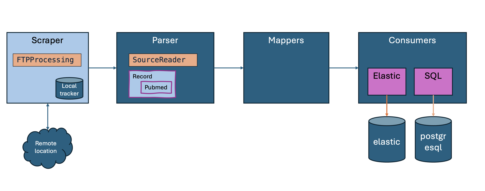

# data-digger-java

This repository takes care of parts of the content data feed that powers curieo baseline search.

There is a number of readers here, all of which must be run in live mode to keep the indexes up to date.

(c) 2024 MD for Curieo Technologies BV  


## Setting up

* Make sure you have a [Java JDK](https://jdk.java.net/21/) installed.
* For local build, make sure you have [Maven](https://maven.apache.org/install.html) installed.

## Configuration
From the root folder run the following commands
```sh
mkdir config
touch config/credentials.json

wget https://repo1.maven.org/maven2/org/slf4j/slf4j-simple/2.0.11/slf4j-simple-2.0.11.jar -P config
```

Add the following content to the config/credentials.json file and replace the placeholders with the actual credentials.
```json
{
  "pubmed-updates": {
    "server": "ftp.ncbi.nlm.nih.gov",
    "password": "****",
    "remotepath": "/pubmed/updatefiles/",
    "user": "anonymous"
  },
  "postgres-datadigger": {
    "password": "****",
    "database": "jdbc:postgresql://localhost:5432/pubmed",
    "user": "<USER>"
  },
  "openai": {
    "organization": "org-HkACSjWCxgkeC3R7OVHA0Sew",
    "key": "****"
  },
  "pubmed": {
    "server": "ftp.ncbi.nlm.nih.gov",
    "password": "****",
    "remotepath": "/pubmed/baseline/",
    "user": "anonymous"
  },
  "test": {
    "key": "****"
  },
  "postgres-postgres": {
    "password": "****",
    "user": "<USER>"
  },
  "elastic": {
    "server": "127.0.0.1",
    "password": "****",
    "apiKey": "****",
    "port": "9200",
    "fingerprint": "****",
    "user": "elastic",
    "url": "http://127.0.0.1:9200"
  },
  "pubmedcommons": {
    "server": "ftp.ncbi.nlm.nih.gov",
    "password": "****",
    "remotepath": "/pubmed/pubmedcommons/",
    "user": "anonymous"
  }
}
```

* Building locally involves two steps:
```sh
# in the root folder (data-digger-java)
mvn clean install -DskipTests
# in the ETL folder (data-digger-java/data-digger-etl)
mvn package assembly:single -DskipTests
```

The last step will build a 50MB jar that is referenced in the `load-pubmed.sh` script.

## Running
From the root folder, run the `load-pubmed.sh` script. This script will scrape the FTP server for new files, parse the files, map the data, and store it in the database.

```sh
# Cleanup the status files if exist
rm -f config/status.json
rm -f config/baseline-status.json
rm -f config/updates-status.json

# Run the script
./data-digger-etl/scripts/load-pubmed.sh <OPTION>
```

Options:
1. `pubmed-2-elastic`
2. `pubmed-updates-2-elastic`
3. `pubmed-baseline-2-postgres`
4. `pubmed-updates-2-postgres`
5. `pubmed-updates-2-postgres-20-100`
6. `pubmed-updates-2-postgres-20-1000`
7. `pubmed-updates-2-both`

## General Overview
The general purpose of this module is to retrieve data from any data source, map it to the right format, and then store it into data stores that are fit for downstream purposes.

.

In this process, all components are designed to be interchangeable, although of course this is not true: not all sources are eligible to be stored in all downstream data storages. But technically, the architecture is consistent.


### Scraping
We currently support scraping from FTP sources through the `FTPProcessing` class. Filtering by file extensions is done and we keep track in a local tracker file of which files we have seen on the remote location. On the _file_ level, this avoids loading a file twice. If you want to start with a clean slate, deleting the local tracker file will do that. 

### Parsing
Currently only pubmed parsing is supported. All records are supposedly implementing the "Record" interface.

### Mapping
We map `PubmedRecord` to `StandardRecord` for serialization purposes.

We map `PubmedRecord` to `Authorship` to be able to store authorships per record.

We map `StandardRecord` to `Embeddings` through an embeddingsservice to store embeddings.

### Storage
Storage is encapsulated in `Consumer` classes (extended to `Sink` for some extra admin tasks).

* SQLConsumer : storing in database
* ElasticConsumer : storing in elastic search


## Configuration

* If you want to Set up and configure an Elastic Search Database, e.g. in a local docker or on a remote server.
* Credentials for all services call must be stored in a hidden `credentials.json` file in the `config` folder. This file has the following format (e.g. for ElasticSearch connectivity)


```json
{
  "elastic" : {
    "url" : "http://127.0.0.1:9200",
    "server": "127.0.0.1",
    "port" : "9200",
    "apiKey" : "<SECRET>",
    "fingerprint": "<SECRET>",
    "user": "elastic",
    "password": "<SECRET>"
  },
  "pubmed": {
    "server" : "ftp.ncbi.nlm.nih.gov",
    "remotepath": "/pubmed/baseline/",
    "user" : "anonymous",
    "password" : "does not matter"
  }
}

```

The application will search for these credentials to access Elastic.

The script will scrape a remote handle to import data into the specified database.

See the [load-pubmed.sh](./data-digger-etl/scripts/load-pubmed.sh) script for the example.

The script maintains a status file that records progress on the overall scraping process.


## Embeddings service
The embeddings service needs to be live when you start running the process. The URL location of the Embeddings service must be specified through the `-e` parameter on the command line of the `data-digger-etl` process.

There are two alternatives for bringing an embeddings service to life.

### embeddings_server.py (script)
For running embeddings that are _not_ covered by huggingface embeddings inference server, you can use a home-made flask app (make sure to have flask installed). This server app is in path `./data-digger-etl/scripts/embeddings_server.py`, and run like so:

```sh
python3 -m flask --app pubmed/data-digger-etl/scripts/embeddings_server.py run
```

It can support, eg. the `all-mpnet-base-v2` embeddings that HF currently does not support.

### text-embeddings-inference (local)
Clone [text-embeddings-inference](https://github.com/huggingface/text-embeddings-inference). Also build locally on Mac, like so.


```sh
git clone https://github.com/huggingface/text-embeddings-inference
# To build locally on Mac, do this:
cargo install --path router -F candle -F meta
```

The download your model of choice, and run the text router locally; pointing the model to the folder that contains the local model; 
e.g. like so:

```sh
git clone https://huggingface.co/avsolatorio/GIST-Embedding-v0
text-embeddings-router --model-id GIST-Embedding-v0
```
This works like a charm.

### text-embeddings-inference (hugging face API)
Pick one of your liking. As long as the interface is compliant; which means that:

_input_ must be one or more sentences after "inputs";

```json
{ "inputs": [ "text1", "text2" ] }
```

_output_ must be one vector per sentence;

```json
[[0.001, -0.38, ... ], [ 0.234, ... 0.782 ]]
```


## Content Sources
Now represented are:

- Pubmed

Under development are:
- Patent data (USPTO)


Data is normalized to the effect that all data fit into a single database.
We're aiming to first outdo [ChemSpider](https://www.chemspider.com/).


### Pubmed

Pubmed data is drawn from [FTP](https://ftp.ncbi.nlm.nih.gov/pubmed/baseline/).
There is an annual baseline that must be augmented by daily updates.
This process needs daily runs to stay up-to-date.

### USPTO
Data from [https://bulkdata.uspto.gov/](https://bulkdata.uspto.gov/).

# Data Storage
Into Elastic and PostgreSQL currently.

## Elastic Storage
You can set up elastic storage remotely or locally.

## PostgreSQL


