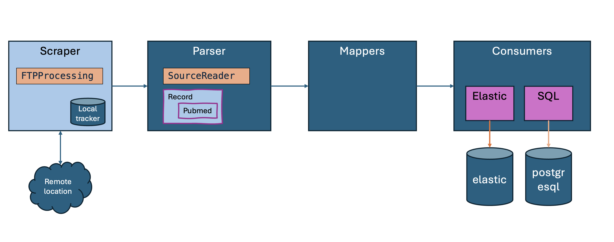

# data-digger-java

This repository takes care of parts of the content data feed that powers curieo baseline search.

There is a number of readers here, all of which must be run in live mode to keep the indexes up to date.

(c) 2024 MD for Curieo Technologies BV  


## Setting up

* Make sure you have a [Java JDK](https://jdk.java.net/21/) installed.
* For local build, make sure you have [Maven](https://maven.apache.org/install.html) installed.

## Configuration
Copy the `.env.template` file to `.env` in the root folder and configure the necessary environment variables.

```sh
cp .env.template .env
```

* Building locally involves two steps:
```sh
# in the root folder (data-digger-java)
mvn clean install -DskipTests
# in the ETL folder (data-digger-java/data-digger-etl)
mvn package assembly:single -DskipTests
```

The last step will build a 50MB jar that is referenced in the `load-pubmed.sh` script.

## Running
From the root folder, run the `load-pubmed.sh` script. This script will scrape the FTP server for new files, parse the files, map the data, and store it in the database.

# Run the script
./data-digger-etl/scripts/load-pubmed.sh <OPTION>
```

Options:

3. `pubmed-baseline-2-postgres`
4. `pubmed-updates-2-postgres`
5. `pubmed-updates-2-postgres-20-100`
6. `pubmed-updates-2-postgres-20-1000`
7. `pubmed-updates-2-both`

## General Overview
The general purpose of this module is to retrieve data from any data source, map it to the right format, and then store it into data stores that are fit for downstream purposes.

.

In this process, all components are designed to be interchangeable, although of course this is not true: not all sources are eligible to be stored in all downstream data storages. But technically, the architecture is consistent.


### Scraping
We currently support scraping from FTP sources through the `FTPProcessing` class. Filtering by file extensions is done and we keep track in a local tracker file of which files we have seen on the remote location. On the _file_ level, this avoids loading a file twice. If you want to start with a clean slate, deleting the local tracker file will do that. 

### Parsing
Currently only pubmed parsing is supported. All records are supposedly implementing the "Record" interface.

### Mapping
We map `PubmedRecord` to `StandardRecord` for serialization purposes.

We map `PubmedRecord` to `Authorship` to be able to store authorships per record.

### Storage
Storage is encapsulated in `Consumer` classes (extended to `Sink` for some extra admin tasks).

* SQLConsumer : storing in database

## Configuration
The script will scrape a remote handle to import data into the specified database.

See the [load-pubmed.sh](./scripts/load-pubmed.sh) script for the example.

## Content Sources
Now represented are:

- Pubmed

Under development are:
- Patent data (USPTO)


Data is normalized to the effect that all data fit into a single database.
We're aiming to first outdo [ChemSpider](https://www.chemspider.com/).


### Pubmed

Pubmed data is drawn from [FTP](https://ftp.ncbi.nlm.nih.gov/pubmed/baseline/).
There is an annual baseline that must be augmented by daily updates.
This process needs daily runs to stay up-to-date.

### USPTO
Data from [https://bulkdata.uspto.gov/](https://bulkdata.uspto.gov/).

# Data Storage
Into PostgreSQL currently.

## PostgreSQL


