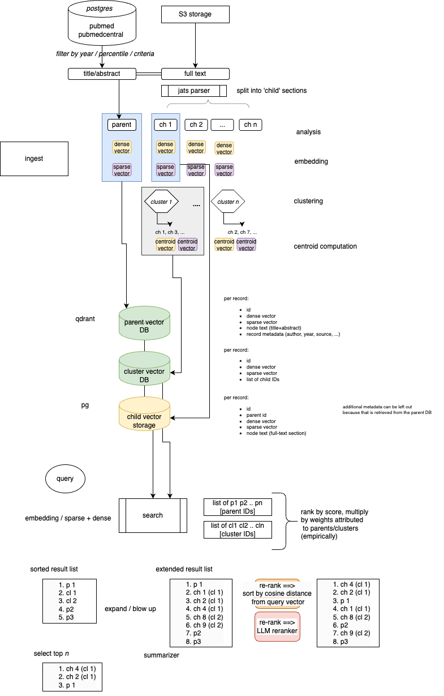

# Testing vectorization

We want to offer functionality to search in full text articles. Article sizes can be anywhere from 8 to 20 or more pages, so this represents a challenge in storage and retrieval.

### Ingest of Pubmed documents into the search index
The concept is that each document within a certain profile (Year, Citation Ranking) is retrieved from the database.
On additional conditions (Year, Ranking, Availability) the full-text of documents is retrieved from the `S3` source. 

The documents are analyzed into sections, such that we get:
* parent node (title/abstract)
* child nodes (section 1.1, section 1.2, ... section n.n)

Each of these sections are submitted to two different vectorization algorithms:
* dense vectorization [BAAI/bge-large-en-v1.5](https://huggingface.co/BAAI/bge-large-en-v1.5)
* sparse vectorization (Splade)

Based on the _dense vectors_, the child sections are clustered (in utils/clustering.py, using [umap](https://umap-learn.readthedocs.io/en/latest/clustering.html)).
For each of these clusters, a _centroid_ is computed using `numpy`:

```python
# averaging multiple vectors into a single vector
cluster_dense_centroid = np.mean(np.array(embeddings), axis=0)
```

The sparse embeddings are also averaged. This is done by a bespoke algorithm `average_sparse` (there may be a library method for this, but I did not find it).

The sparse and dense embeddings of the _parent_ nodes are stored in the _parent_ vector index (QDrant) along with their metadata.
The (averaged!) sparse and dense embeddings of the clusters are stored in the _cluster_ vector index (QDrant) along with their metadata. This metadata includes _pointers to the child nodes_.

### Searching pubmed documents.
During the search stage, both the cluster and the parent vector databases are searched. On the best matches in the cluster database, the child nodes are retrieved (including vectors) and matched. These matched are mixed and balanced with the parent matches and combined into the final search results.

# Testing the setup.
In order to prove that this works, we need to prove that finding the child nodes by mediation through the cluster nodes works, and that the averaging of vectors works without loss of accuracy.

For testing this (and testing the averaging) we set up the following test.

### Testing step 1
We pick a collection of pubmed documents (200 pubmed docs from 2023-2024 with corresponding full text; that makes 155).

```sql
    SELECT pubmed, pmc, CONCAT('s3://pubmed-fulltext/bulk/PMC', 
                SUBSTRING(LPAD(SUBSTRING(pmc, 4, 10), 9, '0'), 1, 3), 
                'xxxxxx/', pmc, '.xml') AS FullTextLocation  FROM datadigger.linktable lt 
    JOIN datadigger.records r on lt.pubmed = r.identifier
    WHERE Year>2022 AND pmc LIKE 'PMC%'
    ORDER BY YEAR DESC
    LIMIT 200
```
And upload them into a postgresql database (#4841 rows)

### Testing step 2
We process these documents in dense and sparse embeddings following the logic described for the 'ingest'. Full text documents are JATS-parsed into subsections, sections are clustered, everything is vectorized and stored.

### Testing step 3
We cluster the child nodes into clusters. Clusters are stored, also, in a postgresql database.

### Testing step 4
All cluster vectors are retrieved from the database and stored in a numpy array.
We select _n_ (5) random documents from the set, and try to find them back by mediation through the clusters. 
This works, _all_ documents are retrieved with match scores exactly 1.0 (both dense and sparse vector match score). Other documents are ranked according to summated match scores and appear to be feasible matches. 

## Learnings
We noted a number of things along the way.
1. The core idea of mediating section searches through clusters has been validated. This works.
2. Short documents tend to be found more than necessary and this is not a good thing. Length normalization needs to be thought through. However, this effect may go away with the QDrant database - we do not know exactly how the matching logic operates in the QDrant database; perhaps QDrant has length normalization built-in. The current numpy-based matching misses length-normalization.
3. The algorithms need proofing against _empty_ texts and other marginal conditions. The JATS parser, in some marginal cases, outputs empty text (or just 'TABLE' content) and this needs to be dealt with appropriately.
4. The JATS parser never seems to produce 1.* sections. This is unexpected.
5. Scores by sparse-vector matching, normalized to 0.0 ... 1.0, are generally much lower than the scores on dense-vector matching.
This is just a fact of the matching logic (both in-product, or dot-product computation) where sparse-vectors -by being so specific- have so much less overlap in dimensions that scores are dramatically pushed down. This effect _may_ go away on larger databases with more content, at which point sparse-vector matches are dramatically more precise than dense-vector matches. The exact mitigation for this effect needs to be decided by experimentation. A short-cut to boot sparse-vector matches may be to simply apply SQRT(sparse_score) but this feels like a sledge-hammer.
6. Score cut-offs cannot be established on the limited set of data that we experimented with. The best approach should be to aim for a query response of a reasonable number of tokens (e.g. 2000 tokens) that are the basis for summarization and generation by the LLM, and then, by experimentation, establish what a reasonable score-cutoff is that results in 95% of the cases in a response of _at least_ that size; such that in the vast majority of cases, there is enough 'material' to work with.

---





